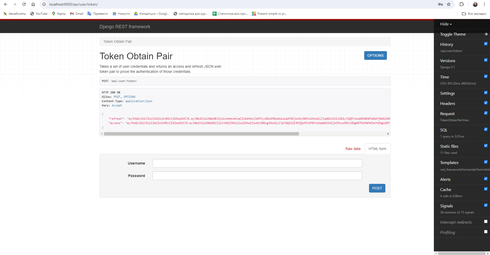
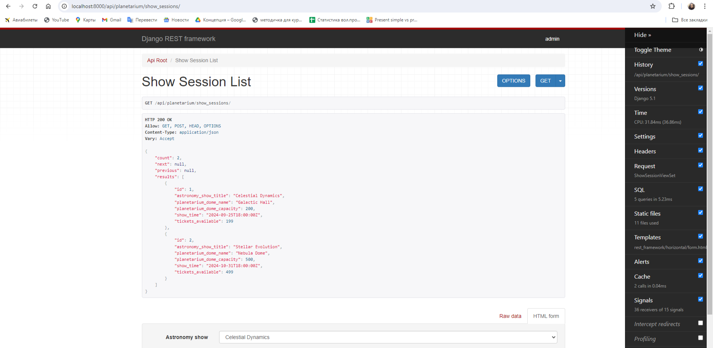
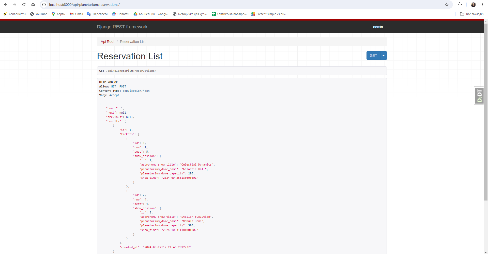

# Planetarium Management API Service

A RESTful API service for managing a planetarium, built using Django Rest Framework (DRF).  
This service includes functionalities for managing planetarium domes, show themes, astronomy shows,  
show sessions, reservations, and tickets.  
It is designed to be deployed using Docker, ensuring a consistent environment across different setups.  


## Features  

- JWT Authentication  
- Admin Panel  
- Swagger Documentation  
- CRUD for Planetarium Domes, Show Themes, Astronomy Shows, Show Sessions, Reservations  
- Custom Permissions  
- Custom Validations  
- Search and Ordering  
- Pagination  
- User Management  

Technologies: Django/Django Rest Framework, PostgreSQL (production), SQLite (development), Docker/Docker Compose  


## Prerequisites

- Python 3.12   
- Docker  
- Docker Compose  
- PostgreSQL (production)  
- SQLite (development)


## Setup  

1. Create a `.env` file in the root directory of the project and add your environment variables.  
   Use `.env.template` as an example.  

2. Ensure Docker Compose configuration:  
   Your `docker-compose.yml` should be configured to connect to the PostgreSQL database and handle media files.  
   Verify that your `docker-compose.yml` file includes the necessary configurations.  


## Installing

```bash
git clone https://github.com/Irina17191/planetarium-api-service/tree/develop  
cd planetarium_api_service  
python -m venv venv  
source venv/bin/activate  # On Windows use `venv\Scripts\activate`  
pip install -r requirements.txt  
Set environment variables in the .env file.
```

## Run with docker  

```bash
1. This command will build the Docker images and start the containers for the Django application and PostgreSQL database:  
docker compose build  
2. Up Docker containers:  
docker compose up  
3. Create superuser:  
docker exec -it <container_id> /bin/sh  
python manage.py createsuperuser  
```

## Run locally  

```bash  
python manage.py migrate  
python manage.py runserver  
```

## Getting access  

Create user via /api/user/register/    
Get access token via /api/user/login/  


Credentials to get access:  

Username: admin  
Email address: admin@admin.com  
Password: 12345Adminpassword


## API Documentation  

These endpoints provide interactive documentation and schema definitions for the API:
- OpenAPI Schema:  
GET /api/schema/
  

- Swagger UI:  
GET /api/schema/swagger-ui/
  

- ReDoc:  
GET /api/schema/redoc/  


Here is a screenshots of the application:  
  

  

